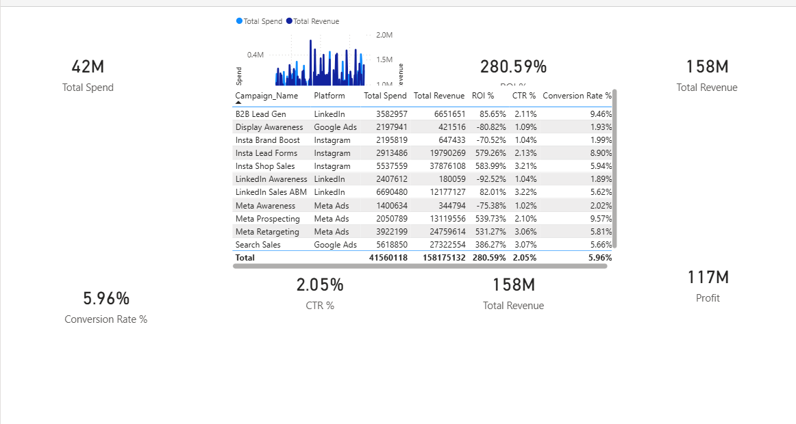
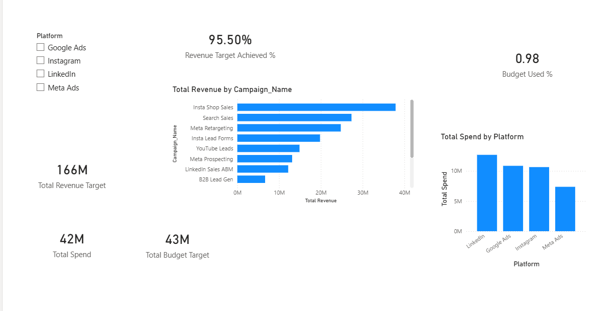

# Marketing Campaign Performance Dashboard

This project analyzes digital marketing campaign performance using Power BI.

The dashboard provides insights into marketing spend, revenue generation, ROI, and campaign effectiveness across multiple advertising platforms.

## Tools Used
- Power BI
- Data Visualization
- Marketing Analytics
- DAX

## Key Metrics

- Total Spend: 42M
- Total Revenue: 158M
- Profit: 117M
- ROI: 280.59%
- CTR: 2.05%
- Conversion Rate: 5.96%

## Platforms Analyzed

- Google Ads
- Instagram
- LinkedIn
- Meta Ads

## Features

- Interactive platform filtering
- Campaign-level performance analysis
- ROI and profit tracking
- Revenue vs spend comparison
- Target achievement monitoring

## Dashboard Preview

### Page 1 – Campaign Performance

### Page 2 – Platform Analysis

## Insights

- Instagram Shop Sales generated the highest revenue.
- Meta Retargeting campaigns produced strong ROI.
- Display Awareness campaigns had negative ROI.
- Overall revenue target achievement is 95.5%.

## Author

Atharv Jagtap
